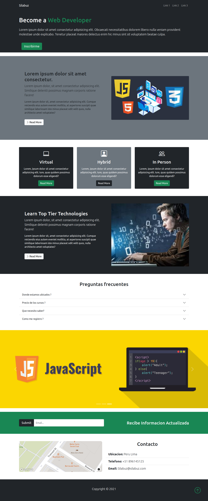
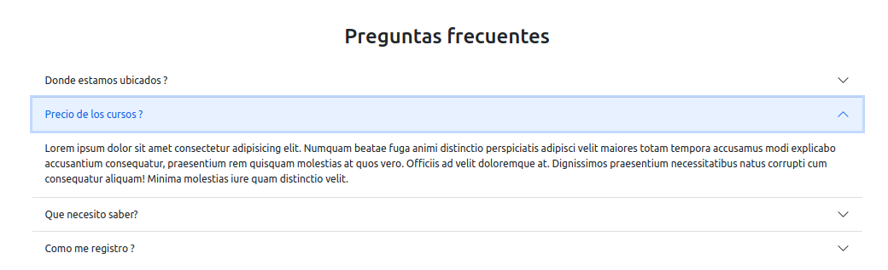
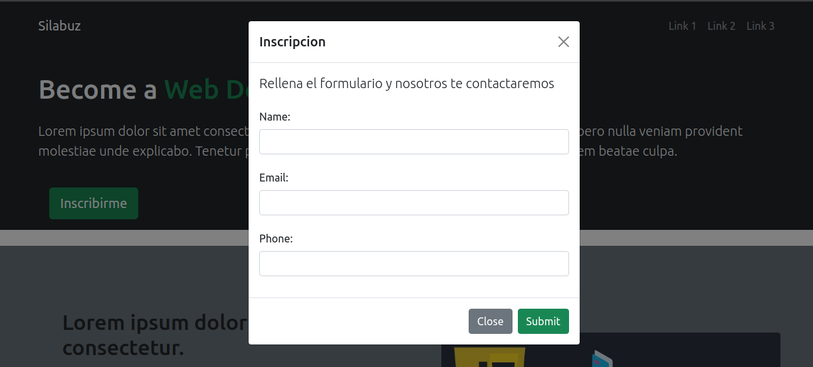

# Desarrollar un pagina web como se muestra a continuacion

## Requerimientos especificos

- la web debe incluir un carousel
  
  

- la web debe incluir un Acordeon
  

- Modal de inscripcion
  
